<div align="center">



<br><br>

[](LICENSE)
[](CHANGELOG.md)
[](#what-protocol-v2-guarantees)
[](#)
[](https://claude.com/claude-code)

**[Website](https://atomic-remote.vercel.app)** · **[Install](#install)** · **[Protocol v2](#what-protocol-v2-guarantees)** · **[Design history](ROADMAP.md)**

</div>

---

# atomic-remote

**Command running [Atomic](https://github.com/bastani-inc/atomic) sessions from Claude Code.**

A Claude Code plugin that turns any Atomic (by Bastani) session running in a terminal into a
remotely-commandable agent: send prompts, steer it mid-run, interrupt it, track its workflow
runs to completion, and read back replies that are *provably yours* — plus a headless one-shot
runner over Atomic's official RPC mode.

Zero dependencies. Local-only. Built exclusively on Atomic's documented extension APIs.

```
┌─────────────────┐   command files (JSON)   ┌──────────────────────────────┐
│  Claude Code    │ ───────────────────────► │  ~/.atomic/agent/            │
│  (this plugin)  │                          │    remote-bridge/<sid>/inbox │
│  atomic-ctl     │ ◄─────────────────────── │    remote-bridge/<sid>/outbox│
└─────────────────┘   attributed replies     └───────────▲──────────────────┘
                      + workflow lifecycle               │ pi.sendUserMessage()
                                             ┌───────────┴──────────────────┐
                                             │  Atomic TUI session          │
                                             │  + atomic-remote-bridge.ts   │
                                             │    (extension, protocol v2)  │
                                             └──────────────────────────────┘
```

## Why

Claude Code plans; Atomic executes — with its own heavy machinery (multi-stage workflows,
Playwright verification, independent verifier panels). This plugin is the wire between them.
You keep watching Atomic work live in your terminal; Claude Code drives it programmatically.

## Install

**1. Claude Code side** — add this repo as a marketplace and install:

```bash
claude plugin marketplace add uppifyagency/atomic-remote
claude plugin install atomic-remote@atomic-remote
```

**2. Atomic side** — from any Claude Code session run `/atomic-remote:setup`
(or manually: `node scripts/install-bridge.mjs`). Then, **inside the running Atomic
session**, run `/reload`. You'll see: `atomic-remote bridge v0.2.0 active (…)`.

Sessions are named automatically after their working directory; override with
`/remote-name <name>` inside Atomic or `/name` (tracked automatically).

## Use

From Claude Code — slash commands or plain natural language (the bundled skill teaches
Claude the whole flow):

```
/atomic-remote:list
/atomic-remote:send auto "Run the tests and fix what fails" --wait
/atomic-remote:status my-project
/atomic-remote:interrupt my-project "Stop — priorities changed, fix the login bug first"
```

Direct CLI:

```bash
node scripts/atomic-ctl.mjs list [--json] [--all]
node scripts/atomic-ctl.mjs ping <target>
node scripts/atomic-ctl.mjs status <target>
node scripts/atomic-ctl.mjs send <target|auto> "message" \
    [--mode prompt|steer|follow_up|interrupt] [--wait] \
    [--idle-timeout <s>] [--timeout <s>] [--message-file <path>]
node scripts/atomic-ctl.mjs follow <target> [--for <s>]
node scripts/atomic-ctl.mjs tail <target> [--lines <n>]
node scripts/atomic-ctl.mjs abort <target>
node scripts/atomic-ctl.mjs prune [--older-than <days>]
node scripts/rpc-run.mjs [--atomic <bin>] "one-shot headless prompt"
```

### Command modes

| Mode | Effect on the Atomic session |
|---|---|
| `prompt` | New user message; starts a turn (queued as steer if busy) |
| `steer` | Redirects the agent between turns of its current run |
| `follow_up` | Waits until the agent finishes, then delivers |
| `interrupt` | Aborts the current turn and starts on your message immediately |

### What protocol v2 guarantees

- **Attributed replies.** Commands are bound to their turn through Atomic's documented
  `input` event; every record carries an `owner` id. `--wait` concludes on
  `agent_settled` — the documented terminal event — for *your* command, or refuses
  (exit 6) when concurrent user input makes attribution unsafe. It never guesses.
- **Workflow-aware waits.** If your command launches an Atomic workflow, `--wait`
  follows the run to its terminal lifecycle notice instead of printing
  "Workflow started" as if it were the result.
- **Liveness by heartbeat.** Sessions are `live` / `stale` / `closed` based on a 5 s
  heartbeat — not on a transient engine pid that Atomic legitimately replaces.
  Delivery to a dead bridge is refused up front, not discovered by timeout.
- **Nothing is deleted implicitly.** `list` is read-only; history survives session
  shutdown; cleanup happens only via the explicit `prune` command, closed sessions only.
- **Fail-closed inbox.** Schema-validated commands, `O_NOFOLLOW` + regular-file +
  64 KiB checks, serial processing, at-least-once semantics with restart recovery,
  an ack for every command — including malformed ones.

### Exit codes

| Code | Meaning |
|---|---|
| 0 | Completed; stdout is the attributed reply |
| 2 | Idle/absolute timeout (session may still be working — check `tail`) |
| 3 | No live session / delivery refused (stale heartbeat) |
| 4 | Ambiguous target |
| 5 | Bridge or run error (including failed workflows) |
| 6 | Attribution uncertain — concurrent user input; inspect with `tail` |
| 7 | Detached async work still running (workflow run id printed) |

## Security

Anything that can write into `~/.atomic/agent/remote-bridge/*/inbox/` commands your agent
with your full user permissions. Directories are created `0700`, files `0600`. Do not widen
those permissions and do not expose the inbox over the network without authentication.
The outbox contains assistant output (i.e., your project's code) and is `0600` for the
same reason.

## Requirements

- [Atomic by Bastani](https://github.com/bastani-inc/atomic) ≥ 0.9 (Node 22 runtime)
- Claude Code with plugin support
- macOS / Linux (Windows untested; the transport is plain files, the liveness beacon is
  portable, but `O_NOFOLLOW` and mode bits degrade gracefully at best)

## Design history

`ROADMAP.md` documents the adversarial multi-agent review that produced protocol v2:
five analysis lenses, API-reality verification against Atomic's official docs, a value
skeptic, and a synthesis — 30 proposals distilled to the 5 shipped here.

## License

MIT © Vlad Vrinceanu
